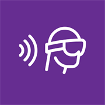
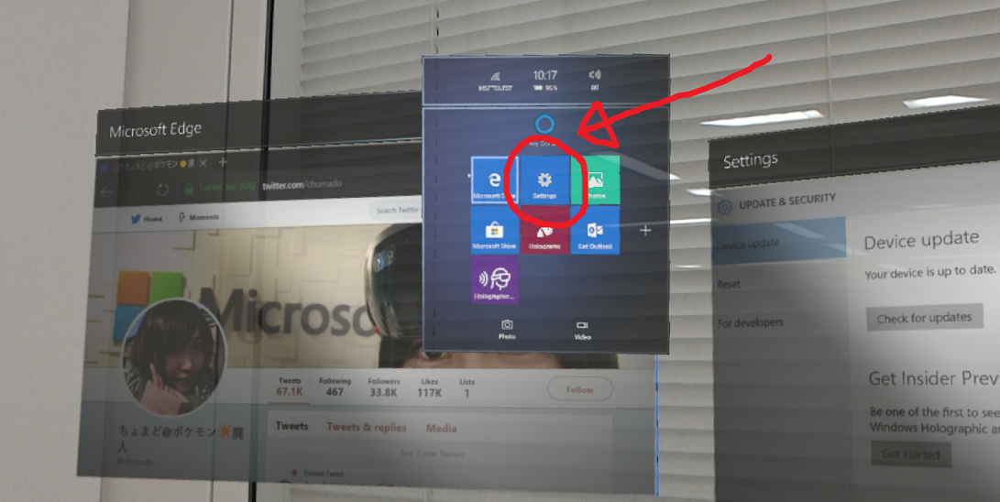
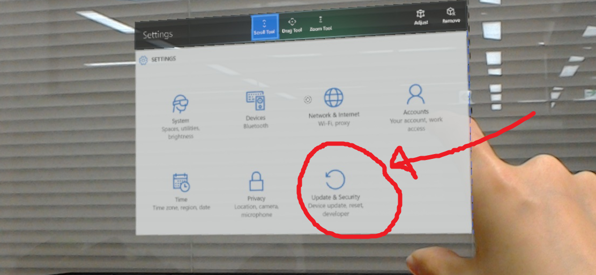
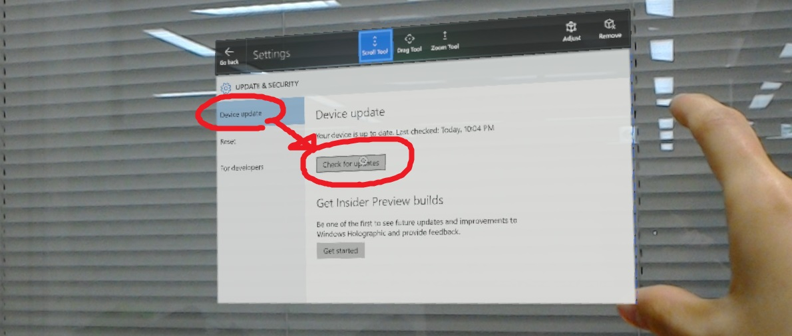
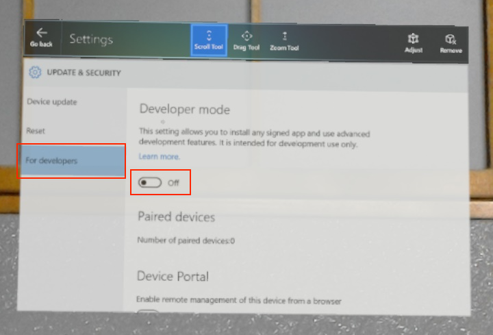
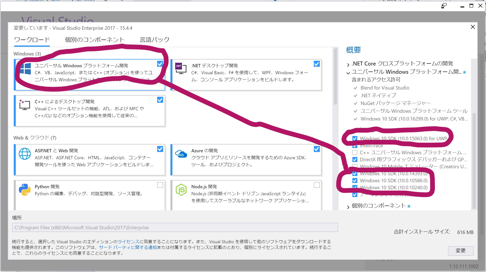
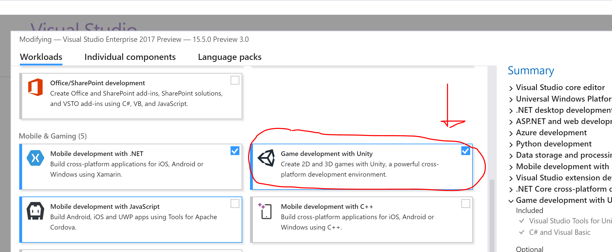
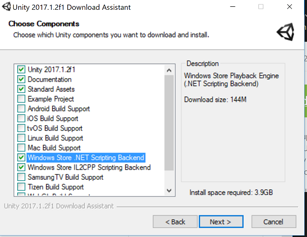

注意！

今後は新しいドキュメントの [github.com/chomado/WindowsMR_GettingStarted/](https://github.com/chomado/WindowsMR_GettingStarted/blob/master/documents/02_InstallationChecklist.md) を更新していくつもりです。

なのでこちらの記事はもう古くなっていきます

ーーーーーーーーー

# HoloLens ハンズオン

（このドキュメントについて、Pull Request 大歓迎です）

## スケジュール

HoloLens 初めての人向けのハンズオンです。   

#|時間|やること|詳細
----|----|----|----
0|前日までに|事前準備|<a href="#prep">こちらの開発環境構築(準備)</a>を完了させておいてください
1|30分間|セミナー (座学)|HoloLens 概要<ol><li>Windows Mixed Reality (MR) とは</li><li>HoloLens 用アプリ開発の流れ</li></ol>
2|15分間|デモ|今日のハンズオンの流れのデモ
3|15分間|HandsOn (1)|初めての HoloLens チュートリアル。 各種操作方法についてレクチャー 
4|90 - 120分間|HandsOn (2)|ハンズオン手順の資料は当日お配りします。 もし時間が余ったら[本社 HoloLens チームの作ったチュートリアル集「Academy」](https://developer.microsoft.com/windows/mixed-reality/academy?WT.mc_id=dotnet-0000-machiy)があります。[日本語訳](https://github.com/HoloMagicians/HolographicAcademyJP/tree/master/Academy)
5|おまけ|お勧めアプリ紹介|よくMR体験会で使われているアプリ紹介。[こちらの記事](https://blogs.msdn.microsoft.com/shintak/2017/08/01/hololensapps2017h1/?WT.mc_id=dotnet-0000-machiy)を参照

# HoloLens ハンズオン - 開発環境の準備編 -

## 開発 PC と HoloLens の事前準備について

このハンズオンを受講頂くにあたり、準備していただきたい環境の一覧を載せます。
当日は開発 PC と HoloLens を持参してください。

(インストール済みアプリのバージョン確認手順や、具体的なインストール手順は、表の下に記入しています)

#|種類|項目|バージョン|ダウンロード先|当日までのアクション
----|----|----|----|----|----
1 |開発機の OS|Windows 10|Fall Creators Update (10/16 公開) 適用済 (つまり `16299.15` 以上)|Windows 設定アプリの「更新とセキュリティ」から|開発 PC にインストール
2 |HoloLens の OS|Windows Holographic 10|最新のバージョン|`Settings`  > `Update & Security` > `Device Update` > `Check for updates` `開発者モード` に設定します(方法は後述)|HoloLens にインストール
3 |開発環境|Visual Studio 2017|`15.4.4`|[visualstudio.com/ja/downloads/](https://www.visualstudio.com/ja/downloads/?WT.mc_id=dotnet-0000-machiy)|開発 PC にインストール
4 |開発環境|Unity|`2017.1.2`|[unity3d.com/.../archive](https://unity3d.com/get-unity/download/archive) の「Unity 2017.1.2」のインストーラで `Windows Store` 用コンポーネント 2 つをチェック入れた状態でインストール|開発 PC にインストール
5|SDK|UWP SDK|`10.0.15063` と `10.0.14393` の両方|Visual Studio のインストーラの「編集」から|開発 PC にインストール
6|SDK|VS 用 Unity用コンポーネント|--|Visual Studio のインストーラの「編集」から `Unity によるゲーム開発` にチェックし入れ「変更」|開発 PC にインストール
7|SDK|MixedRealityToolkit-Unity for Unity|`v1.2017.1.2`|[github.com/Microsoft/.../Unitypackages](https://github.com/Microsoft/MixedRealityToolkit-Unity/tree/master/External/Unitypackages) の「HoloToolkit-Unity-v1.2017.1.2.unitypackage」|開発 PC にダウンロード
8 |HoloLens 用アプリ|Holographic Remoting|最新版| **開発 PC ではなく、HoloLens にインストールしてください。** HoloLens の Windows Store から「[Holographic Remoting](https://www.microsoft.com/store/p/holographic-remoting-player/9nblggh4sv40?WT.mc_id=dotnet-0000-machiy)」で検索してインストール| **HoloLens に** インストール

## 詳細

## 1. 開発 PC の OS

Windows 10 Fall Creators Update (ビルド番号 `16299`) に統一します。一応 Windows 10 Creators Update (ビルド番号 `15063`) も対応しています。

項目|値
----|----
Windows 10 バージョンの確認方法|こちらを参照:「[Windows のバージョン確認方法](https://www.microsoft.com/safety/protect/ver_win.aspx?WT.mc_id=dotnet-0000-machiy)」の「ビルド番号」
使用するバージョン|Fall Creators Update (10/16 公開) が適用されている (つまり`16299.15` 以上) 要は Windows 10 の最新の状態にしておけば間違いないです。(not Insider Preview 版)
アップデートの手順|こちらを参照：「[Windows Update の利用手順 - Windows 10 の場合](https://www.microsoft.com/safety/protect/musteps_win10.aspx?WT.mc_id=dotnet-0000-machiy)」

また、追加の操作として、`開発者モード` を有効にします。

`設定` > `更新とセキュリティ` > `開発者向け` > `開発者モード`

## 2. HoloLens の OS

HoloLens の OS のバージョンを最新版に更新します。

まずスタートメニューを出します。     
スタートメニューを出すには `Bloom(ブルーム)` (開花) というジェスチャーをします。下の動画のように、手のひらをぶわっとやってください。

すると、スタートメニューが出てきます。

ここの [ `Settings` ] に視点を合わせ、クリック。( `Air tap` という動作をします)

すると設定ウィンドウが上がってくるので、次は [ `Update & Security` ] をクリック。

`Device Update` > `Check for updates` ( > `Restart now (今すぐ再起動)`)

この作業を `Your device is up to date` (最新) となるまで繰り返します。

### HoloLens を開発者モードに

開発 PC と同様に、HoloLens も開発者モードにします。
   
`Settings` > `Update & Security` > `For Developers` > `Developer mode` を ON にする

こちらの記事が詳しいです：    
[HoloLens チュートリアルの実機動作 by @Suna ](https://qiita.com/Suna/items/194989d8fa1d9bc3cc97)     
↓その記事の画像から        
     

## 3. 開発 PC にインストールする Visual Studio のバージョン

Visual Studio 2017 をインストールします。インストール済みの場合は最新版に更新します。

項目|値
----|----
Visual Studio 2017 バージョンの確認方法|Visual Studio 2017 を起動 > メニューバーの `ヘルプ` (一番右) > `Microsoft Visual Studio のバージョン情報` で出てきたウィンドウの、2 行目に書いてあります (例：`Version 15.4.4`)
必要なバージョン|`15.4.4`
インストール方法|こちらからダウンロード：[https://www.visualstudio.com/ja/downloads/?WT.mc_id=dotnet-0000-machiy](https://www.visualstudio.com/ja/downloads/?WT.mc_id=dotnet-0000-machiy)

## 5. VS インストーラーにて、UWP SDK & `Game development with Unity` をインストール

4 番目の Unity よりも先にこちらを実行してください。

HoloLens のアプリは Windows 10 アプリ(正確に言うと`UWP アプリ`)です。開発にあたり、対応したバージョンの SDK が必要となります。

まず、Visual Studio 2017 のインストーラから「編集」を選びます。

そして **必ず** 以下の SDK にチェックを入れてから「変更」をクリックしてください。
- `10.0.15063`
- `10.0.14393`

また、Unity でのゲーム開発コンポーネントも一緒に入れます。

`Unity によるゲーム開発`

そして、右下の「変更」を押してインストールが開始されます。

## 4. Unity

3D アプリを開発するために、今回は Unity を使います。

最新のバージョンではなく、`2017.1.2` を準備してください。

ダウンロードはこちらから：    
[unity3d.com/.../archive](https://unity3d.com/get-unity/download/archive) の「Unity 2017.1.2」の「インストーラー」

インストール時に、**必ず** 以下のオプションにチェックを入れてからインストールしてください。

* `Windows Store .NET Scripting Backend` 
* `Windows Store IL2CPP Scripting Backend` 

## 
