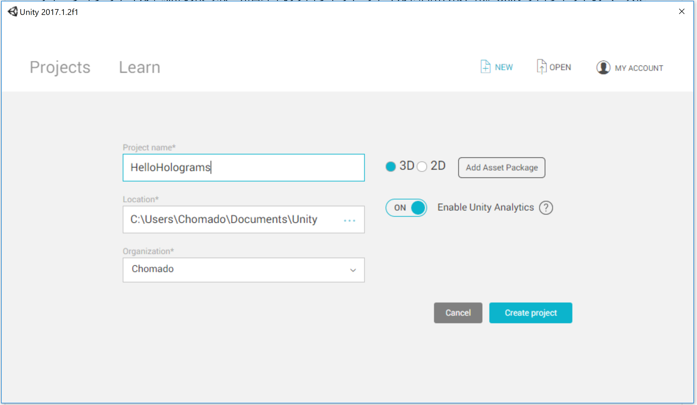
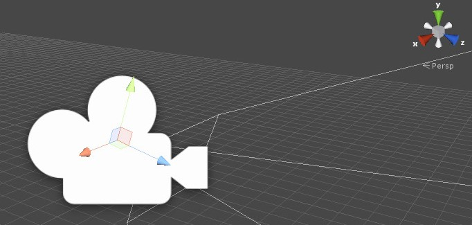
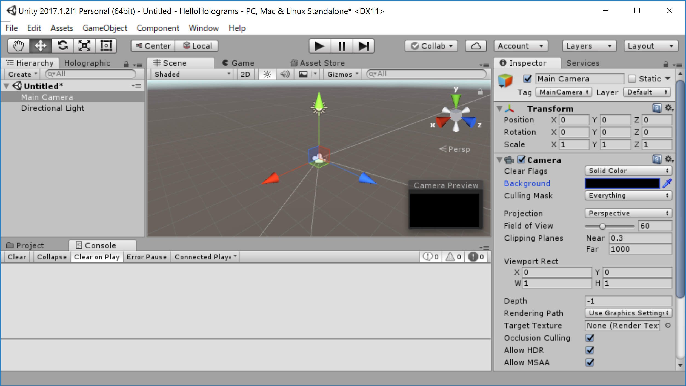
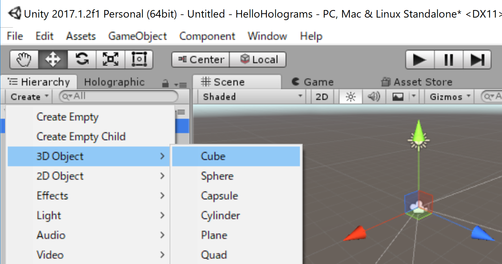
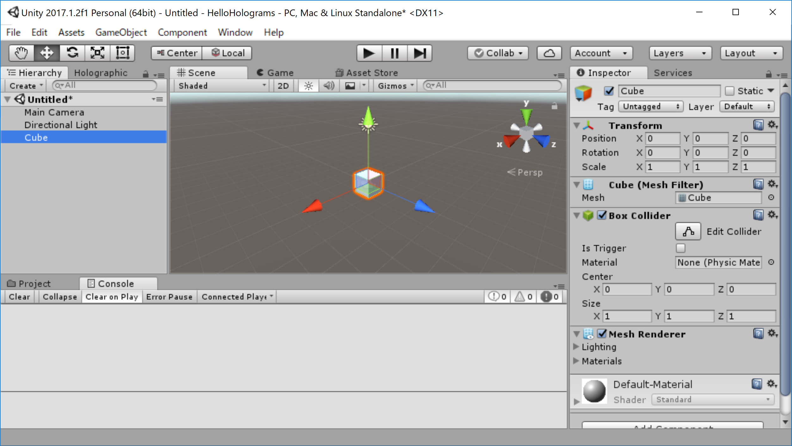

# 初めての HoloLens アプリ

## 1. Unity プロジェクトの新規作成

Unity を起動します。（ Windows キーを押して「`Unity`」とタイプして enter を押せば起動します）

1. [ `New` ]  (新規作成) を選ぶ
2. プロジェクト名を入力。（例： `HelloHolograms` )
1. [ `3D` ] をチェック
1. [ `Create Project` ] (プロジェクトの作成) をクリック

プロジェクトが作成されました。

## 2. 「カメラ」(視線の起点) の設定

Unity の `Camera` とは、主にゲーム中の視点に使われるオブジェクトです。    

HoloLens アプリでは、メインカメラには自分(プレイヤー)の頭の位置をトラッキングして欲しいので、座標を `(0, 0, 0)` に設定します。

また、デフォルトでは「背景」が「青空」のテクスチャがかかっています。（私もお天気の良い空好きです。）    
しかし、HoloLens アプリでは背景は現実世界を映してほしいので、背景色を無効(真っ黒)にする必要があります。

それらを設定していきましょう。

1. 【メインカメラオブジェクトを選択】 [ `hierarchy` ]　(ヒエラルキー/階層)パネルの [ `Main Camera` ] をクリック
1. 【カメラの位置をプレイヤーの頭の位置に】 [ `Inspector` ] (インスペクター) パネルの [ `Transform` ] (変換) コンポーネントで、 [ `Position` ] (位置) を ` (X: 0, Y: 0, Z: 0)` に変更
1. 【現実世界を映すため、背景テクスチャを無効に】 同じく [ `Inspector` ] (インスペクター) パネルの、 [ `Clear Flags` ] (クリア フラグ) ボックス一覧の [ `Skybox` ] (スカイボックス) を [ `Solid Color` ] (単色) に変更
1. そして　[ `Background` ] (背景)の色の選択を選び、真っ黒にする。

## 3. オブジェクトの配置

あなたの目の前にキューブ（立方体）を置いてみましょう。

1. [ `hierarchy` ]　(ヒエラルキー/階層)パネルの [ `Create` ] (作成) ボックスの中から  [ `3D Object` ]　→ [ `Cube` ]を選択
2. Cube が設置される

